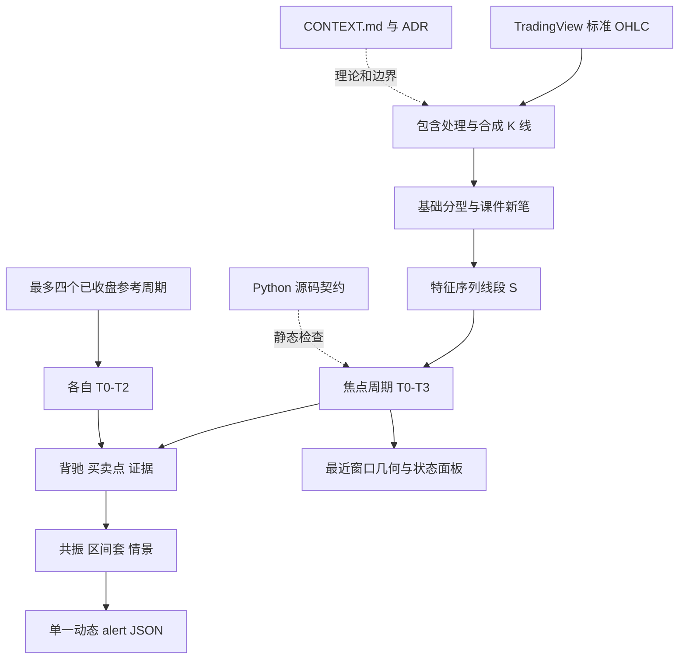

# System architecture

## 概览

项目的唯一运行交付物是 `chanlun.pine`。它在同一个 Pine v6 overlay 指标内依次完成标准 OHLC 归一、方向相关包含、基础分型与课件新笔、特征序列线段、`T0-T3` 走势递归、证据组合、绘制和动态 `alert()`。

## 状态边界

- 焦点周期确认状态由已收盘图表 K 线增量摄入；活动 K 线在隔离的尾部副本上生成候选视图。
- 参考周期通过 `request.security(..., lookahead_on)` 配合表达式内 `[1]` 只读取已收盘来源柱；每个参考引擎独立维护结构。
- 当前工作树不保存完整历史 lifecycle ledger。活动结构数组可重建，提醒只用有界去重键保留最近事件身份。
- 全历史结构计算与 `detailBars` 最近窗口绘图分离；Python 测试只验证源码契约，官方 Pine v6 编译与图表运行才是兼容判据。

## 已知审查边界

- 焦点周期在最后一根实时 K 的每个 tick 复制历史数组并全量重建 `S/T0-T3`。
- 展示层在每个最后柱更新删除并重建可见 line、label、box。
- 参考周期同型更极端端点更新不设置 `structuresDirty`；确认前缀不受影响，但参考候选层级可能延迟刷新到下一次新笔边界。
