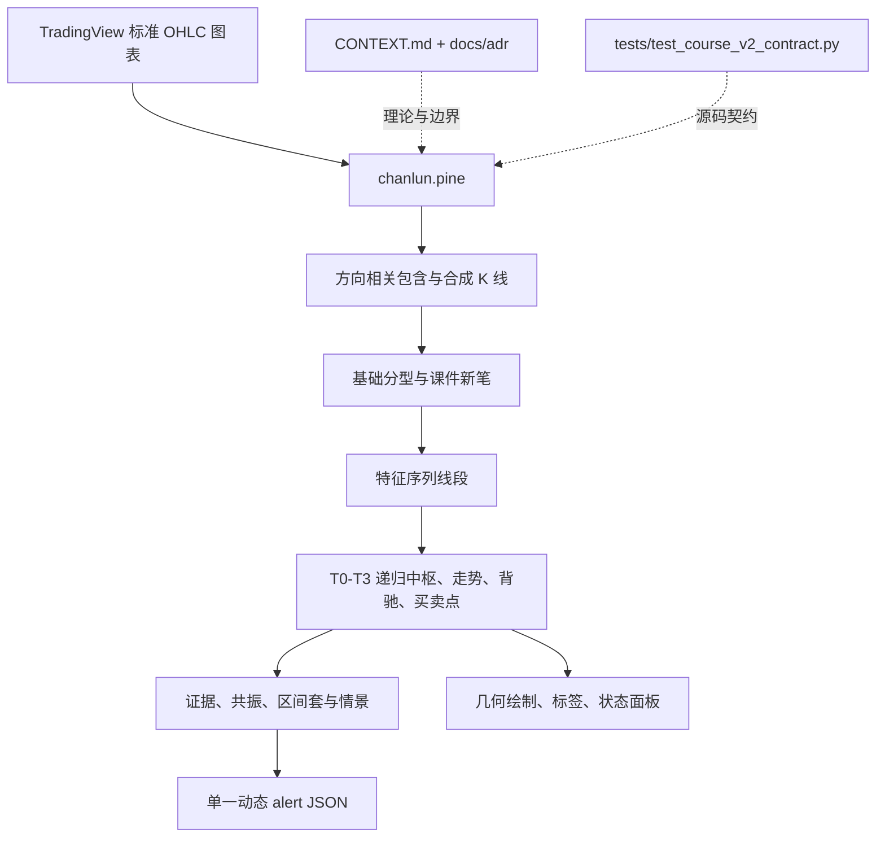

# System architecture

## 概览

项目是面向 TradingView 免费版的单文件 Pine v6 指标。计算、展示和提醒同处 `chanlun.pine`，但以明确的阶段与数据边界隔离：行情标准化与 K 线处理、递归结构引擎、结构事件/提醒、以及最后一根 K 线上的绘制与面板。

`CONTEXT.md` 是结构术语的唯一词汇表；`docs/adr/` 固化理论、时间语义、递归边界和资源优先级。Python 合约测试只检查源码中可审计的约束；TradingView Pine v6 编译和图表运行才是最终兼容判据。

## 模块图

## 约束

- 焦点周期绑定当前图表并完整递归到 `T3`；最多四个严格更高的参考周期只递归到 `T2`。
- 确认只使用各自周期已收盘数据；活动 K 线仅形成隔离候选，不能改写确认结构。
- 全历史计算与最近详细几何绘制窗口分离，以满足每类最多 500 个绘图对象及免费计划预算。
- 指标不实现策略下单、仓位、收益或回测。
