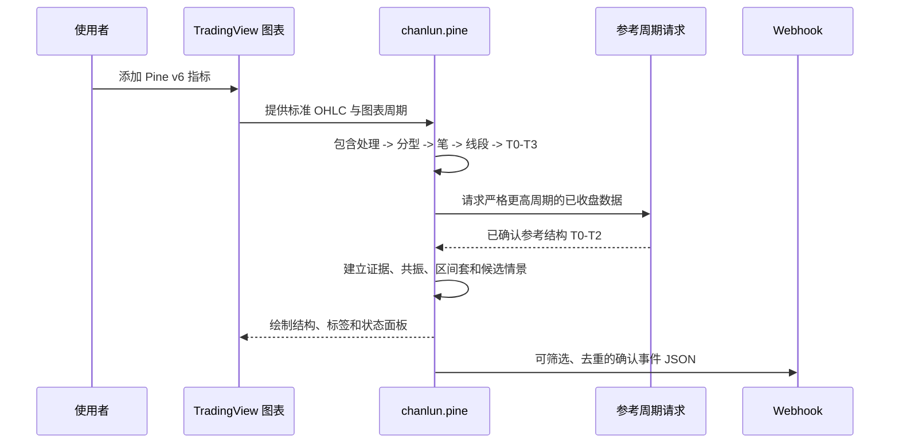

# Key flows

## 典型分析路径

用户把 `chanlun.pine` 粘贴到 TradingView Pine Editor，并将指标添加到标准 OHLC 图表。指标按图表周期处理全部可用历史，构建焦点周期结构；参考周期只在自身收盘后提供确认结果。最后一根 K 线根据展示预设输出有限几何和状态面板；符合筛选条件的确认事件经单一 `alert()` 发送。

## 关键时间规则

- 结构时间记录结构端点发生时间；确认时间记录实时首次可知时间。
- 候选结构可被替换或失效；确认结构冻结，不被未来 K 线回改。
- 非标准图表停止确认信号；参考周期的未收盘状态不得参与确认共振或默认提醒。
