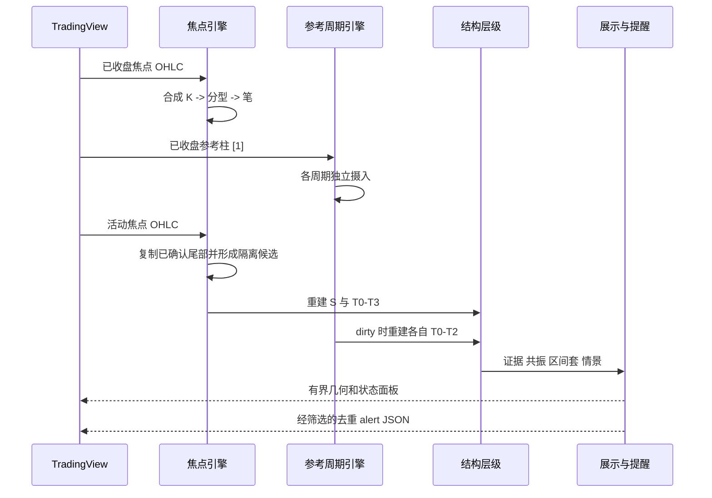

# Key flows

## 已收盘与活动状态

## 时间与确认规则

- `structureTime` 是理论结构端点时间；`confirmationTime` 是全部确认条件首次可知时间。
- 已确认结构应冻结；候选结构可以移动、被替换或失效。
- 默认提醒只发送确认事件；候选提醒必须显式开启。
- 参考周期只使用其自身已收盘柱，不构造未收盘参考预览。
- 非标准图表停止焦点确认和参考周期分析。

## 当前实现代价

活动焦点 K 每个 tick 都执行历史数组复制、完整层级重建、证据组合及可见对象重建。该路径保证候选即时可见，但尚未有 TradingView profiler 证据证明它在最重配置下满足预算。
