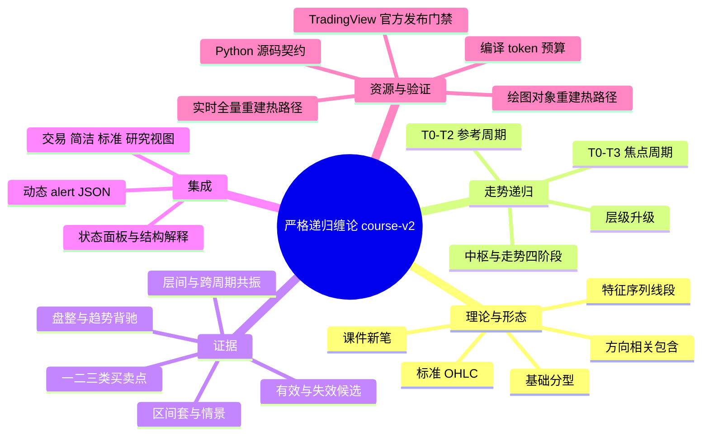

# Feature mindmap

```mermaid
mindmap
  root((严格递归缠论 course-v2))
    理论与形态
      标准 OHLC
      方向相关包含
      基础分型
      课件新笔
      特征序列线段
    走势递归
      T0-T3 焦点周期
      T0-T2 参考周期
      中枢与走势四阶段
      层级升级
    证据
      盘整与趋势背驰
      一二三类买卖点
      有效与失效候选
      层间与跨周期共振
      区间套与情景
    集成
      交易 简洁 标准 研究视图
      状态面板与结构解释
      动态 alert JSON
    资源与验证
      编译 token 预算
      实时全量重建热路径
      绘图对象重建热路径
      Python 源码契约
      TradingView 官方发布门禁
```
