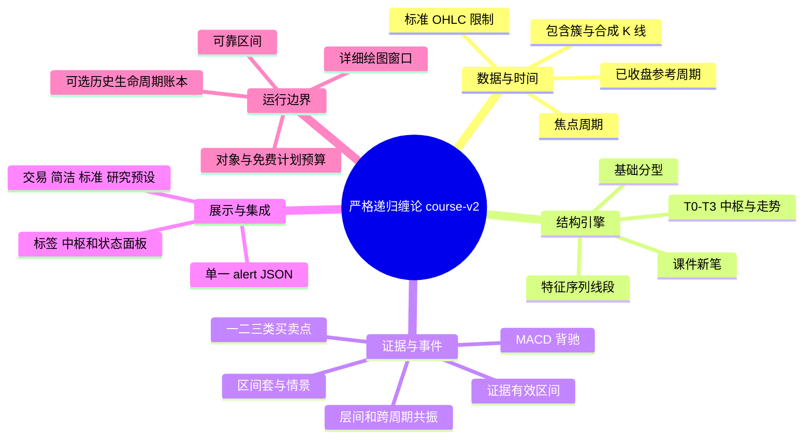

# Feature mindmap

## 功能图谱

```mermaid
mindmap
  root((严格递归缠论 course-v2))
    数据与时间
      标准 OHLC 限制
      包含簇与合成 K 线
      焦点周期
      已收盘参考周期
    结构引擎
      基础分型
      课件新笔
      特征序列线段
      T0-T3 中枢与走势
    证据与事件
      MACD 背驰
      一二三类买卖点
      证据有效区间
      层间和跨周期共振
      区间套与情景
    展示与集成
      交易 简洁 标准 研究预设
      标签 中枢和状态面板
      单一 alert JSON
    运行边界
      可靠区间
      详细绘图窗口
      对象与免费计划预算
      可选历史生命周期账本
```
