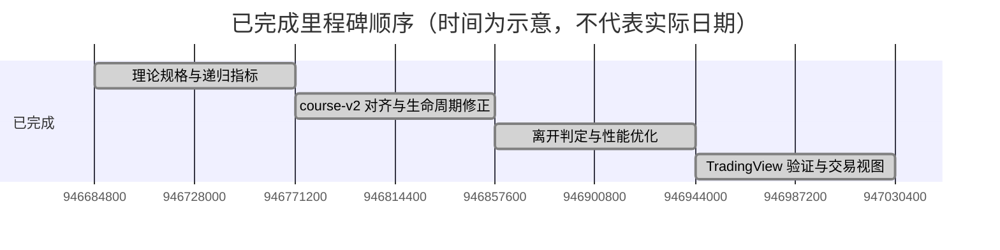

# Roadmap

## 已证实的里程碑顺序

项目提交历史可证实以下演进顺序，但未读取到足以作为路线图日期的计划信息：

1. 定义严格递归指标的理论规格，并交付初始 Pine 指标。
2. 将引擎对齐到 course-v2，修正候选结构、走势生命周期和结构绘制。
3. 将方向感知离开判定合入 course-v2，并针对免费计划执行/内存预算优化重放与账本。
4. 记录 TradingView 验证结果，增加交易视图、显示控制和操作级别。

## 后续

[低置信度] 现有代码、README、ADR 和提交历史没有可证实的未来路线图。应由维护者根据实际优先级补充，而不是从已完成工作推测。
