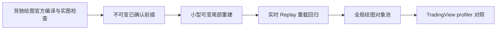

# Roadmap

## 已完成且有证据

1. 当前生产引擎实现包含处理、分型、笔、线段、`T0-T3`、中枢、背驰、买卖点、参考周期、证据组合和动态提醒。
2. 历史 lifecycle ledger 已从生产源码移除；当前 `chanlun.pine` 可观察行为已确立为唯一算法回归基线，spec/ADR 仅作历史背景。
3. 参考候选 dirty 传播和可靠起点时间已修复。
4. 初始方向已改成增量包含簇，预览不再复制 pending 数组。
5. `Unit` 已增加可组合 DIF 上下界；已确认复合结构合并范围/DIF 子扫描，笔尾只扫描新增 DIF 区间，候选保留精确原始区间语义。
6. 盘背和趋势背驰已按实际 `enteringUnit -> leavingUnit` 强度比较段增加连接线，并区分候选、确认、失效候选和已失效状态；连接线使用独立 polyline 配额，不占结构 line 预算。
7. 本地 31 项源码契约和 100000 组确定性种子方向等价检查通过，Brain 链接检查通过。
8. 提交 `958b1d1` 已通过 TradingView 官方 Pine v6 编译器；新增背驰绘图改动仍需重新编译和实图检查。

## 下一阶段

- 核对盘背/趋势背驰的比较端点、顶底方向、候选/确认/失效样式和四层映射。
- 把焦点周期每 tick 的完整 K、MACD、笔数组复制收敛到尾部覆盖层。
- 让 `S/T0-T3`、背驰、点位和证据从最早受影响 child index 重建，而不是每 tick 从头清空。
- 用固定 line/label/box 池和 `set_*` 更新替代全删全建。

## 验证边界

基础优化提交已通过官方 Pine v6 编译。新增背驰 `polyline` 绘图需要再次在 TradingView 编译，并在最重参考周期配置下比较实时、Bar Replay 与重载结构输出和 profiler；spec/ADR 一致性不作为门禁。
