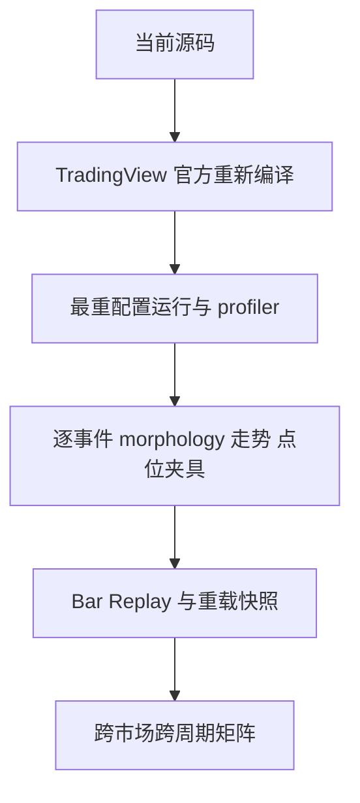

# Roadmap

## 已完成且有证据

1. 交付初始严格递归 Pine 指标并建立领域词汇与 ADR。
2. 将生产引擎统一到 `course-v2`，实现课件新笔、特征序列线段、`T0-T3`、背驰和三类买卖点。
3. 修正方向相关中枢离开判定，恢复实图线段与买卖点显示。
4. 增加交易视图、显示控制、参考周期、证据组合和动态提醒。
5. 为编译 token 预算从当前生产工作树移除历史 lifecycle ledger；本地源码契约通过。

## 当前发布阻塞

- `.scratch/chanlun-theory-v2/issues/05-validate-course-v2.md` 仍未关闭；本地源码契约不能替代这些门禁。
- lifecycle 规格、ADR 0044/0048 与当前生产源码存在范围偏差：规格要求不可变历史事件，ADR 0048 只将账本设为默认关闭，而当前工作树已完全移除。发布前必须明确更新决定或恢复实现。
- 2026-07-27 静态审查识别出参考候选刷新、实时全量层级重建和绘图对象重建三项风险；是否修复及顺序尚未由维护者冻结。

## 低置信度边界

仓库没有维护者确认的交付日期或版本计划，因此这里记录依赖顺序，不虚构日期。
