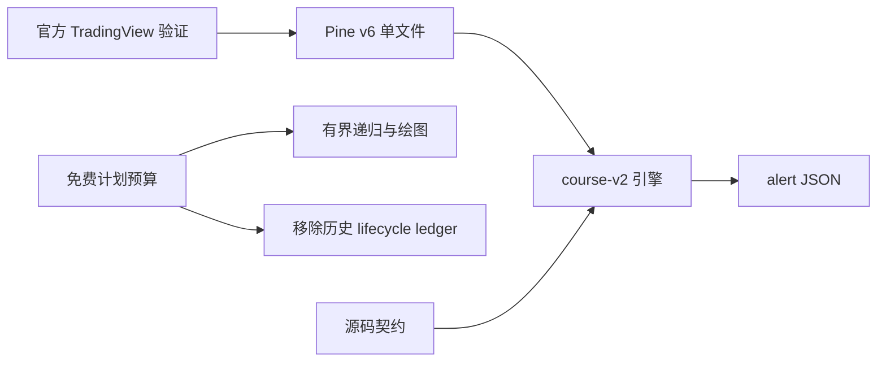

# Tech stack

## 技术选择

| 领域 | 当前决定 | 边界与理由 |
|---|---|---|
| 运行平台 | TradingView Pine Script v6 overlay 指标 | `chanlun.pine` 是唯一运行交付物；官方 Pine v6 编译器与图表运行是兼容判据。 |
| 理论口径 | `course-v2` | 原作者定义与后期回复优先，可复现课件归纳用于工程冻结；旧算法不兼容保留。 |
| 行情输入 | 标准图表 OHLC | 按 `syminfo.mintick` 归一；合成图表停止确认。 |
| 多周期 | 当前图表焦点周期 + 最多四个严格更高参考周期 | 焦点 `T0-T3`，参考 `T0-T2`；参考数据只取已收盘柱。 |
| 结构状态 | Pine UDT 与数组 | 历史摄入增量维护形态层；最后柱重建走势层级与派生证据。 |
| 集成 | 单一动态 `alert()` JSON | 稳定事件身份、结构/确认双时间戳和有界去重。 |
| 静态验证 | Python `unittest` 源码契约 | 快速检查可审计规则，但不执行 Pine 算法，也不证明资源或重绘行为。 |
| 运行验证 | TradingView 手工与临时 Pine 夹具 | 发布所需；当前最新工作树仍待官方重新编译和完整矩阵。 |
| 领域文档 | `CONTEXT.md`、`docs/adr/`、`.scratch/` | 分别承载术语、架构决定、规格与未完成门禁。 |

## 约束关系

