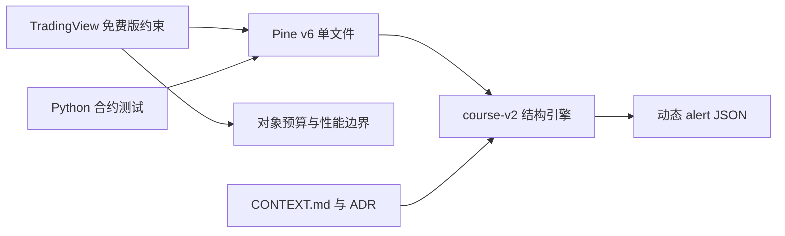

# Tech stack

## 技术选择

| 领域 | 候选 | 决定 | 理由 |
|---|---|---|---|
| 运行平台 | 自建服务、浏览器脚本、TradingView 指标 | Pine Script v6 的 overlay 指标 | 交付物直接运行在 TradingView 图表；官方 Pine v6 是唯一兼容判据。 |
| 核心实现 | 多模块/多语言引擎、单文件 Pine | `chanlun.pine` 单文件 | TradingView Pine Editor 的实际交付形式；避免跨语言实现偏差。 |
| 结构理论 | 多算法兼容、course-v2 | `course-v2` 作为唯一生产真值 | 理论权威有明确分层；旧算法不保留兼容模式。 |
| 测试辅助 | PineTS/本地编译、源码契约测试 | Python `unittest` 源码契约 + TradingView 手工验证 | 本地测试锁定可审计约束；TradingView 验证编译、绘制、资源与实际运行。 |
| 事件集成 | 多提醒、策略 API | 单一动态 `alert()` JSON | 结构事件可筛选、带双时间戳与稳定身份，供 webhook 去重。 |
| 文档 | 自由术语、分散说明 | `CONTEXT.md` + ADR | 术语、理论边界、架构决定各有单一权威来源。 |

## 决策关系

## 未决项

没有从现有代码、文档或提交记录中识别出需要立即决策的技术选项。
